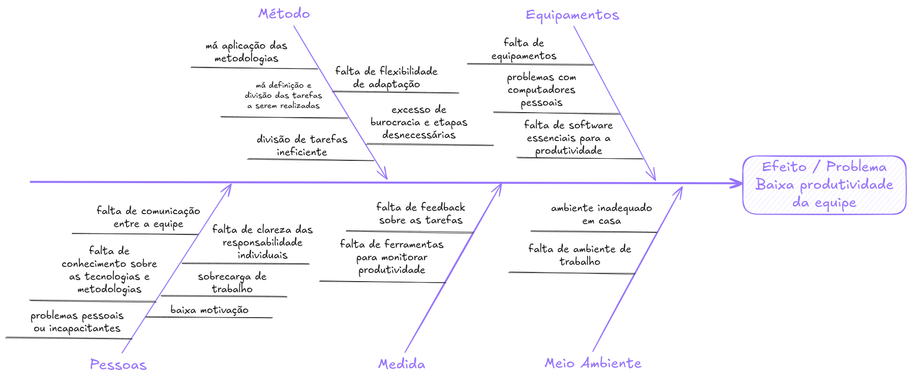
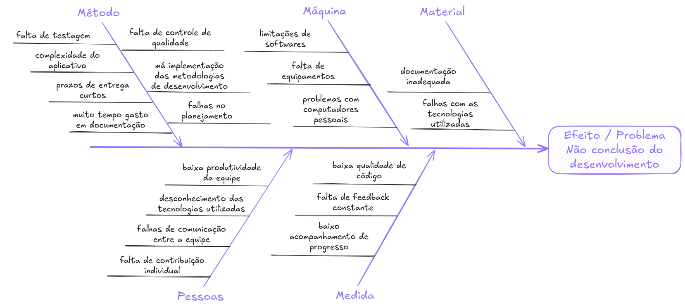
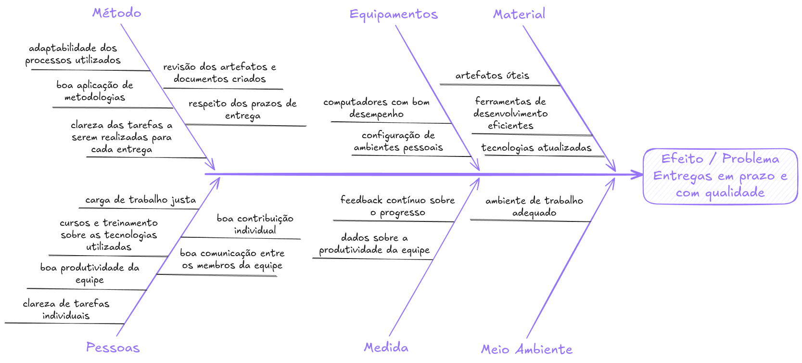
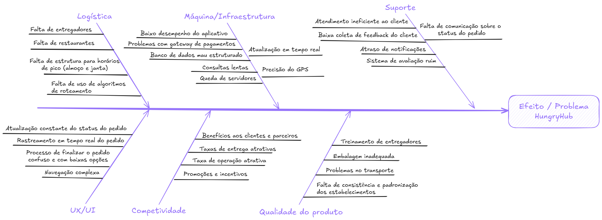
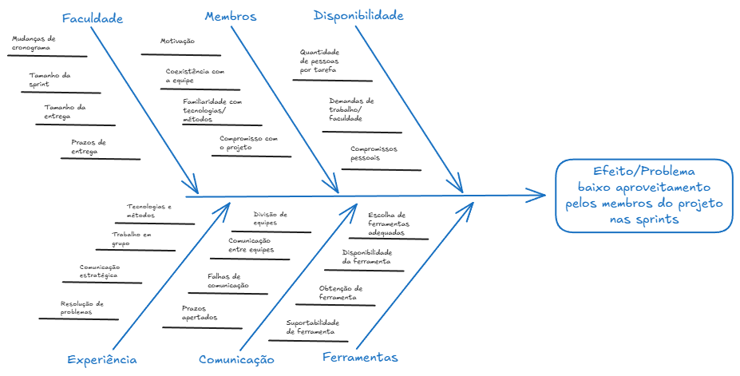
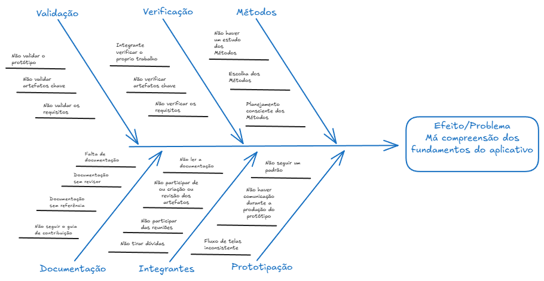

# 1.2.2. Diagrama Causa e Efeito

## Introdução

O diagrama de causa e efeito, ou diagrama de Ishikawa, é uma notação que apresenta uma forma de levantar as principais causas de um problema ou adversidade, analisando os principais fatores envolvidos com o contexto aplicado. Essa ferramenta usa como base os famosos 6M da manufatura, classificando os problemas nessas 6 categorias: Método, Máquina, Material, Mão de Obra, Medida, Meio Ambiente.

## Metodologia 

Para a construção dos diagramas de causa e efeito, o grupo 7 usará a ferramenta [Excalidraw](https://excalidraw.com). Além disso não será usada a notação convencional do diagrama de Ishikawa, mas sim uma adaptação para o contexto do grupo, onde as categorias serão mais livres e diversas em comparação aos 6M definidos originalmente. Na totalidade foram desenvolvidos 4 diagramas de causa e efeito, sendo eles: "Baixa produtividade da equipe", "Não conclusão do desenvolvimento", "Entregas no prazo", sendo estes três mais voltados para o desenvolvimento do projeto da disciplina e o quarto sendo mais voltado para o projeto de software "HungryHub".

## Diagramas de Causa e Efeito

### Baixa produtividade da equipe

**Diagrama 1**: Baixa produtividade da equipe

**Autor**: [Felipe Amorim](https://github.com/lipeaaraujo), [Bruno Vasconcelos](https://github.com/brunocva)

### Não conclusão do desenvolvimento

**Diagrama 2**: Não conclusão do desenvolvimento

**Autor**: [Felipe Amorim](https://github.com/lipeaaraujo), [Bruno Vasconcelos](https://github.com/brunocva)

### Entregas no prazo

**Diagrama 3**: Entregas no prazo

**Autor**: [Felipe Amorim](https://github.com/lipeaaraujo)

### HungryHub

**Diagrama 4**: HungryHub

**Autor**: [Guilherme Westphall](https://github.com/west7)

**Diagrama 5**: Aproveitamento de sprints

**Autor**: [Leonardo Aguiar](https://github.com/Leonardo0o0)

**Diagrama 6**: Compreensão sobre o aplicativo

**Autor**: [Leonardo Aguiar](https://github.com/Leonardo0o0)

## Referências

1. SERRANO, Milene. Arquitetura e Desenho de Software: Projeto e Desenho de Software. Aprender3. Acesso em: 02 de novembro de 2024
2. SANDER, Carlos. Diagrama de causa e efeito: como e quando aplicar? Veja 3 exemplos!. Disponível em: https://frons.com.br/blog/processos/diagrama-de-causa-e-efeito/#:~:text=O%20diagrama%20de%20causa%20e%20efeito%20%C3%A9%20uma%20ferramenta%20utilizada,organiza%C3%A7%C3%A3o%20a%20enfrentar%20certas%20adversidades. Acesso em 02 de novembro de 2024.

## Histórico de Versões

| Versão | Data da alteração | Comentário                         | Autor(es)                                       | Revisor(es) | Data de revisão |
| ------ | ----------------- | ---------------------------------- | ----------------------------------------------- | ----------- | --------------- |
| 1.0    | 01/11/2024        | Criação da introdução do documento | [Felipe Amorim](https://github.com/lipeaaraujo) |             |                 |
| 1.1    | 02/11/2024        | Adição da metodologia              | [Guilherme Westphall](https://github.com/west7) |             |                 |
| 1.2    | 02/11/2024        | Adição dos diagramas               | [Guilherme Westphall](https://github.com/west7) |             |                 |  |
| 1.3    | 02/11/2024        | Adição do diagrama de entregas no prazo               | [Felipe Amorim](https://github.com/lipeaaraujo) |             |                 |  |
| 1.4    | 02/11/2024        | Adição do diagrama 5 e 6           | [Leonardo Aguiar](https://github.com/Leonardo0o0) |             |                 |