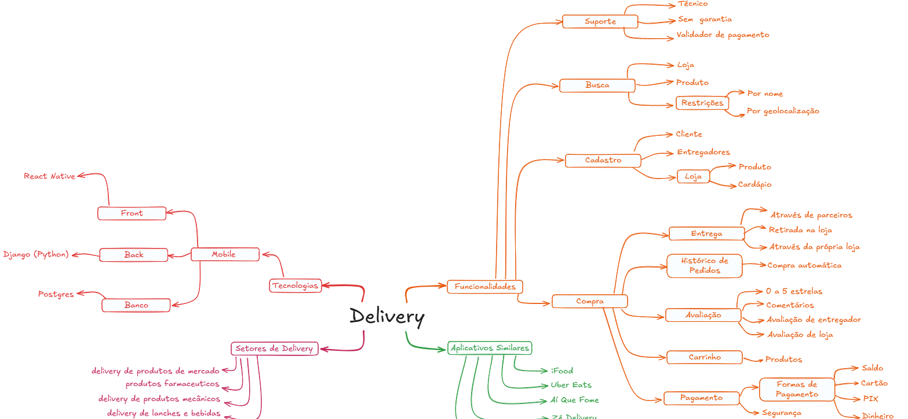

# 1.1.1. Mapa Mental

## Introdução

O Mapa Mental é um artefato iterativo que auxilia na estruturação e organização de informações e ideias de maneira estruturada e organizada. Ele mapeia os principais conceitos e suas conexões de forma hierárquica e associativa, facilitando o entendimento das relações entre ideias centrais e secundárias de um sistema ou projeto. Além disso, promove a exploração criativa e a análise detalhada de um tópico, apoiando a equipe no planejamento, brainstorming e identificação de soluções eficientes.

## Metodologia

Para a criação do mapa mental foi realizada uma reunião, com uma abordagem colaborativa, em que os integrantes contribuíram com ideias e perspectivas sobre a criação de um aplicativo de delivery como a ideia principal. Foram discutidas as funcionalidades, metodologias e tecnologias no processo de desenvolvimento do aplicativo.

## Artefato produzido

**Figura 1**: Mapa Mental

**Autor**: [Bruno Cunha Vasconcelos de Araújo](https://github.com/brunocva), [Davi Gonçalves Akegawa Pierre](https://github.com/DaviPierre), [Felipe Amorim](https://github.com/lipeaaraujo), [Gabryel Nicolas Soares de Sousa](https://github.com/gabryelns), [Júlio Roberto da Silva Neto](https://github.com/JulioR2022), [Lucas Martins Gabriel](https://github.com/martinsglucas), [Guilherme Westphall de Queiroz](https://github.com/west7), [Kallyne Macedo Passos](https://github.com/kalipassos), [Kauan de Torres Eiras](https://github.com/kauaneiras), [Leonardo Sobrinho de Aguiar](https://github.com/Leonardo0o0), [Wolfgang Friedrich Stein](https://github.com/Wolffstein) |

**Link**: https://excalidraw.com/#json=auQh_2HDYa5DChj1MYIny,K_F58nZ4YLJgrZdPg9VQtw

## Referências

1. Mapa Mental. Disponível em: https://www.proximosconcursos.com/como-criar-um-mapa-mental-efetivo/

## Histórico de Versões

| Versão | Data da alteração | Comentário | Autor(es) | Revisor(es) | Data de revisão |
|--------|-----------|-----------|-----------|-------------|-------------|
| 1.0 | 02/11/2024 | Adiciona Introdução, Metodologia e Mapa mental  | [Raquel Ferreira Andrade](https://github.com/raquel-andrade) | [Davi Pierre](https://github.com/DaviPierre) |  |
