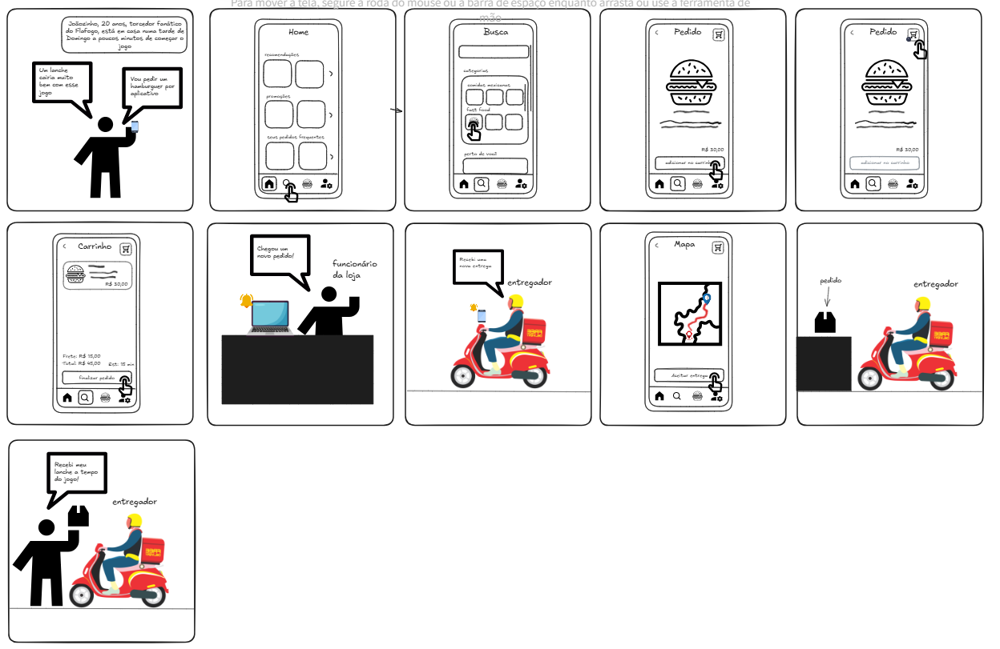

# 1.1.3. Storyboarding

## Introdução

Storyboarding é uma técnica visual utilizada para elaborar a narrativa de um projeto, seja ele um filme, uma peça e mesmo um produto digital. Consiste em uma série de quadros sequenciais, que ilustram as principais cenas, eventos ou interações da história que será contada.

Cada quadro do storyboard geralmente contém uma imagem, um esboço ou uma descrição visual do que ocorrerá naquela cena, acompanhada por legendas ou anotações que explicam ações, diálogos e contextos. A ideia é criar uma representação visual do fluxo do projeto, ajudando a equipe a visualizar e a planejar a narrativa, identificar pontos de transição e entender como as cenas e interações se conectarão.

## Metodologia

Foi organizada uma reunião entre os integrantes da equipe para que em conjunto fosse definido uma situção comum de utilização de um aplicativo de delivery, buscando definir os desejos dos clientes e como o processo de entrega se desenvolve.

## Artefato produzido

**Figura 1**: Storyboarding

**Autor**: [Felipe Amorim](https://github.com/lipeaaraujo), [Júlio Roberto da Silva Neto](https://github.com/JulioR2022),
[Lucas Martins Gabriel](https://github.com/martinsglucas), [Guilherme Silva Dutra](https://github.com/GuiDutra21), [Bruno Cunha Vasconcelos de Araújo](https://github.com/brunocva), [Guilherme Westphall de Queiroz](https://github.com/west7)

**Link**: https://excalidraw.com/#json=auQh_2HDYa5DChj1MYIny,K_F58nZ4YLJgrZdPg9VQtw

## Referências

1. Storyboard. Disponivel em: https://miro.com/pt/storyboard/o-que-e-storyboard/#como-storyboards-s%C3%A3o-usados-na-%C3%A1rea-de-product?

## Histórico de Versões

| Versão | Data da alteração | Comentário | Autor(es) | Revisor(es) | Data de revisão |
|--------|-----------|-----------|-----------|-------------|-------------|
| 1.0 | 02/11/2024 | Adiciona Introdução, Metodologia e inserção de artefatos produzidos  | [Júlio Roberto da Silva Neto](https://github.com/JulioR2022) |  |  |