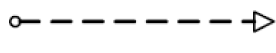

## Introdução

As metodologias ágeis desempenham um papel crucial no desenvolvimento de projetos, proporcionando flexibilidade, eficiência e colaboração contínua entre os membros da equipe. A adoção de práticas ágeis, como Scrum, Kanban e XP, permite uma melhor adaptação às mudanças e uma entrega incremental de valor ao cliente. Neste documento, exploraremos como essas metodologias serão aplicadas no projeto.

## Metodologias

Para a organização do nosso projeto, utilizaremos uma abordagem que combina práticas do Scrum, Kanban e XP. 

### Scrum

O Scrum é um framework ágil para o desenvolvimento de produtos complexos. O Scrum é baseado em um conjunto de valores, princípios e práticas que fornecem a base para a tomada de decisões em um ambiente de mudança e incerteza. O Scrum é composto por três papéis, cinco eventos e três artefatos. Os cinco eventos do Scrum são: Sprint, Sprint Planning, Daily Scrum, Sprint Review e Sprint Retrospective. Faremos uso de três eventos para a organização do nosso projeto:
    
- **Sprint**: É um período de um mês ou menos durante o qual um “Pronto”, utilizável, e um incremento de produto potencialmente liberável é criado. Sprints têm durações consistentes ao longo de um esforço de desenvolvimento. Um nova Sprint começa imediatamente após a conclusão do Sprint anterior.
- **Sprint Planning**: Esse é o ponto de partida de cada sprint. Durante o planejamento, o time de desenvolvimento seleciona itens do backlog que serão desenvolvidos na sprint, com base nas prioridades definidas e na capacidade do time.
- **Sprint Checkpoint**: Momento na metade da sprint em que o time se reúne para reportar seu progresso e seus bloqueios nas atividades. No contexto do projeto, substitui a Daily (Reunião diária).
- **Sprint Review**: Ao final da sprint, o time apresenta o incremento do produto para os demais stakeholders. Essa apresentação é uma oportunidade para coletar feedback sobre o trabalho realizado e verificar se ele atende aos critérios definidos.

Os artefatos do Scrum são:

- **Product Backlog**:  é uma lista ordenada de tudo que é conhecido a respeito do produto que precisa ser feito. 
- **Sprint Backlog**: é a lista de elementos selecionados do Product Backlog que o time de desenvolvimento se compromete a transformar em um incremento de produto potencialmente entregável. 
- **Incremento**: é o produto potencialmente entregável que o time de desenvolvimento constrói a cada sprint.

### Kanban

O Kanban é uma estrutura visual de gestão de trabalho relevante no contexto do desenvolvimento ágil na medida em que permite acompanhar um fluxo contínuo das atividades de forma limpa, simples e eficaz. O quadro Kanban é dividido em colunas que, através do armazenamento dos cartões (tarefas), representam os diferentes estágios do trabalho: 
- **Backlog (to-do)**: Coluna em que ficam listadas todas as tarefas que ainda não foram iniciadas mas que estão previstas para serem executadas.:
- **In Progress**: Coluna que armazena os cartões de tarefas já em execução pelos membros da equipe.:
- **Review/Validation** :Coluna que armazena as tarefas que precisam passar por validação para serem concluídas, caracterizando um ponto de controle de qualidade no processo.  
- **Done**: Coluna que armazena as tarefas que já passaram por todas as outras etapas do processo e foram finalizadas.

No projeto, a estrutura do Kanban será aplicada adaptada em conjunto com as técnicas Scrum e XP, através do uso das GitHub Issues, ferramenta de planejamento e visualização atrelada ao repositório. Dessa forma, os to-dos (tarefas a fazer) são dependentes do Product e Sprint Backlog. 

### XP (Extreme Programming)

O XP (Extreme Programming ou Programação Extrema) é uma metodologia de desenvolvimento de software que se baseia em uma série de valores e princípios como comunicação, simplicidade, feedback, coragem, respeito, feedback rápido, simplicidade, mudanças contínuuas, alta qualidade, pequenos passos e melhoria, fundamentados por um conjunto de práticas de desenvolvimento.

As práticas constituem o núcleo central do processo no XP, as quais ajudam na rapidez, qualidade e flexibilidade no desenvolvimento de um software, são elas: Cliente presente, Planejamento, Stand Up Meeting, Programação em par, Testes constantes, Refatoração, Código coletivo, Padronização do código, Design simples, Metáfora, Ritmo sustentável, Semana de 40 horas, Integração contínua, Releases curtos.

No contexto do nosso projeto tilizaremos uma abordagem adaptada do XP que se refere a dois principais rituais:

- **Programação em pares**: Programação em par (dupla) em um único computador. No nosso contexto, a utilização de ferramentas como o Liveshare, Excalidraw e Miro para a colaboração entre duas ou mais pessoas em um mesmo artefato, diminuindo a possibilidade de falhas e garantindo qualidade dos artefatos.
- **Melhoria contínua (refatoração)**: A revisão e melhoria constante dos artefatos gerados por outros membros, afim de garantir a qualidade e a detecção de possíveis erros.

## Modelagem BPMN

Nesse documento, o fluxo de trabalho do projeto será organizado de acordo com uma adaptação do modelo Business Process Management Notation (BPMN). Esse modelo consiste em organizar os processos em piscinas (pools) contendo as atividades que serão realizadas em cada etapa do projeto. Essas atividades serão subdivididas em raias horizontais (lanes) que representarão os possíveis responsáveis pelo cumprimento das tarefas mencionadas na atividade. Essas raias, por sua vez, serão subdivididas em fases verticais que serão responsáveis por indicar o tempo necessário para o cumprimento das tarefas.
As tarefas, bem como as piscinas, se comunicam umas com as outras por meio de conectores que podem ser vistos na Tabela 1 abaixo.

Tabela 1: Legenda dos conectores

| Imagem                                            S                         | Descrição                                                                   |
| --------------------------------------------------------------------------- | --------------------------------------------------------------------------- |
|                     | Representa o fluxo ideal das atividades em questão                          |
|  | Representa o fluxo das mensagens enviadas de um remetente a um destinatário |
|    | Representa a ligação de uma tarefa ou atividade a um artefato específico    |
´´
Cada uma das piscinas (atividades) terá um símbolo correspondente, que será responsável por representar os diferentes tipos e suas necessidades. Tais símbolos e seus significados podem ser encontrados na Tabela 2 abaixo.

Tabela 2: Legenda dos símbolos das atividades

| Imagem                                                                              | Descrição                                                                                             |
| ----------------------------------------------------------------------------------- | ----------------------------------------------------------------------------------------------------- |
|                    | Representa uma atividade ou tarefa que tem muitoas intricacias para ser classificada                  |
|               | Representa uma atividade ou tarefa que necessita de um serviço externo ou automação ara ser realizado |
|            | Representa uma atividade ou tarefa que envia uma mensagem para outra atividade ou tarefa              |
|  | Representa uma atividade ou tarefa que que recebe uma mensagem de outra atividade ou tarefa           |
|                    | Representa uma atividade ou tarefa que necessita de um trabalho humano para ser concluída             |
|                       | Representa uma atividade ou tarefa que necessita de um trabalho manual para ser conclída              |
|    | Representa uma atividade ou tarefa que utiliza de uma regra de negócio                                |
|  | Representa uma atividade ou tarefa que sua conclusão exige a criação de um script                     |

## Referências 

1. OBJECT MANAGEMENT GROUP. *Business Process Model and Notation (BPMN)*. Disponível em: <https://www.omg.org/bpmn/>.
2. UNIVERSIDADE DE SÃO PAULO. *Notação BPMN 2*. São Paulo: USP, 2017. Disponível em: <https://edisciplinas.usp.br/pluginfile.php/4449285/mod_resource/content/0/Notacao-BPMN%202%20-%202017.pdf>.
3. ATLASSIAN. *Kanban — Uma breve introdução*. Disponível em: <https://www.atlassian.com/br/agile/kanban>.  
4. GUEDES, Marylene. O que é XP - Extreme Programming?. Disponível em https://www.treinaweb.com.br/blog/o-que-e-xp-extreme-programming. Acesso em 02 de novembro de 2024
5. SCRUMGUIDES. *What is Scrum?* Disponível em: https://www.scrumguides.org/docs/scrumguide/v2017/2017-Scrum-Guide-US.pdf

## Histórico de Versões

| Versão | Data da alteração | Comentário                                  | Autor(es)                                    | Revisor(es) | Data de revisão |
| ------ | ----------------- | ------------------------------------------- | -------------------------------------------- | ----------- | --------------- |
| 1.0    | 31/10/2024        | Criação da Introdução, Tabela 1 e Tabela 2 | [Davi Pierre](https://github.com/DaviPierre) |             |                 |
| 1.1    | 02/11/2024        | Adicionando introdução das metodologias | [Felipe Amorim de Araújo](https://github.com/lipeaaraujo), [Kallyne Macedo Passos](https://github.com/kalipassos), [Raquel Ferreira Andrade](https://github.com/raquel-andrade), [Júlio Roberto da Silva Neto](https://github.com/JulioR2022), [Lucas Martins](https://github.com/martinsglucas) |             |                 |